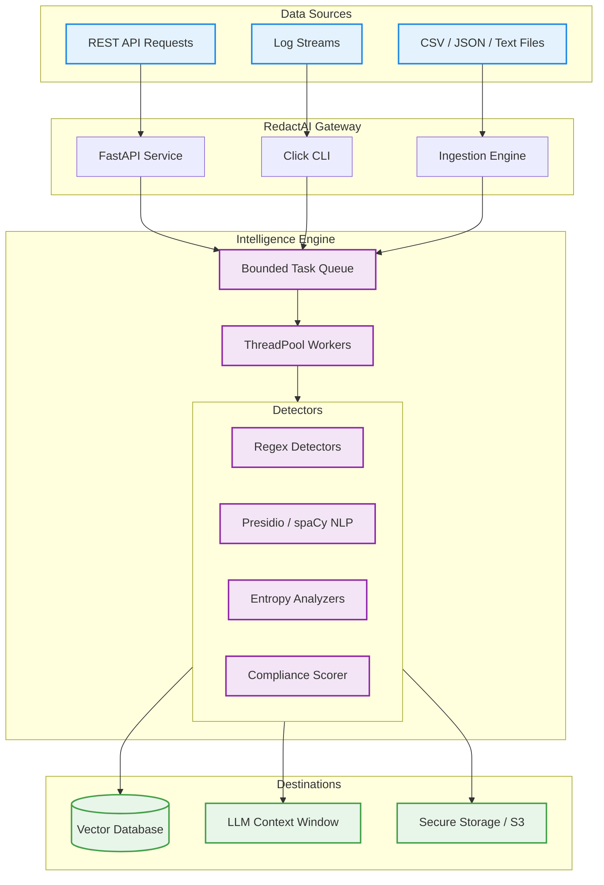
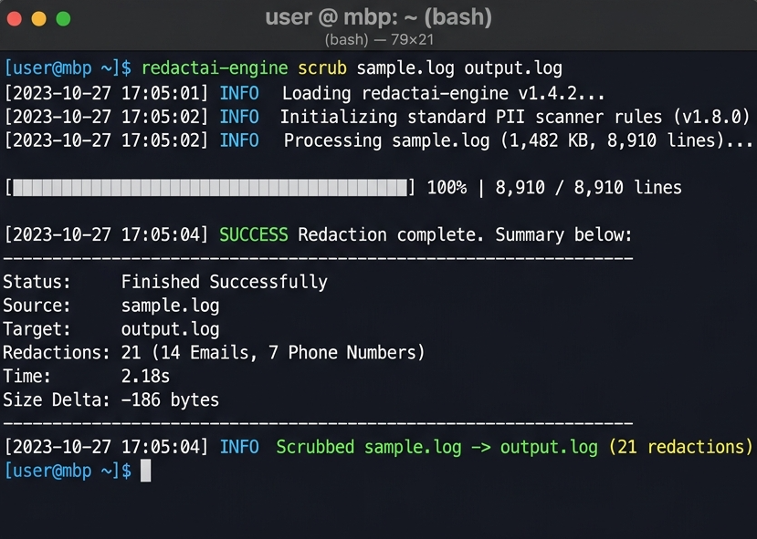
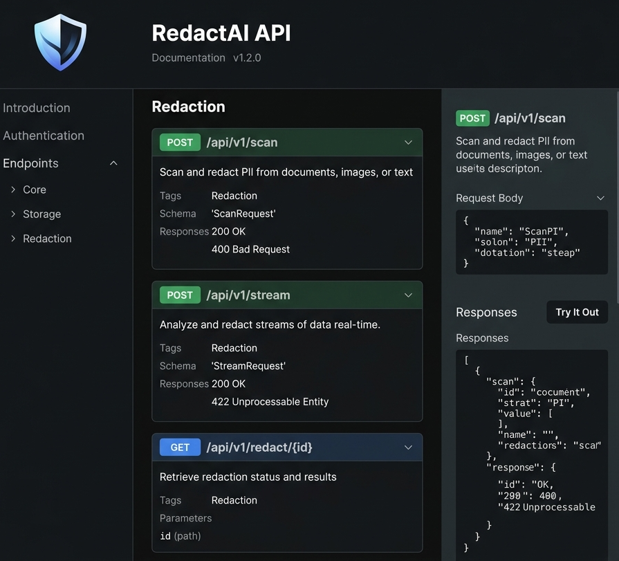

<div align="center">
  

  # RedactAI

  **A production-ready privacy protection toolkit that detects and redacts sensitive information before it reaches AI systems, logs, vector databases, or enterprise storage.**

  [](https://github.com/snahadhar18/Redact-AI/actions)
  [](#)
  [](LICENSE)
  [](#)
  [](#)
</div>

<hr/>

## Problem Statement

As organizations rapidly adopt Generative AI, Retrieval-Augmented Generation (RAG), and vector databases, sensitive data is accidentally being embedded into embeddings, AI context windows, and logs. Traditional regex scrubbers fail at scale, load entire files into memory, lack concurrency, and struggle to keep up with the complexity of modern enterprise systems.

## Why RedactAI Exists

RedactAI was built to solve the AI privacy paradox. It provides an enterprise-grade, memory-safe, and infinitely scalable layer of defense that sits between your data sources and your AI infrastructure. It ships with a pluggable intelligence engine (regex, ML, NLP) wrapped in a robust asynchronous gateway—ensuring that PII, PHI, and credentials are removed **before** they become a liability.

## Real-World Use Cases

- **RAG Data Pipelines:** Scrub enterprise documents (PDFs, docs) before creating embeddings for vector databases like Pinecone or Milvus.
- **AI Chatbots:** Intercept and redact sensitive user input before sending it to OpenAI, Anthropic, or local LLMs.
- **Log Masking:** Continuously tail and sanitize high-throughput application logs before they are indexed in Elasticsearch or Datadog.
- **Compliance Enforcement:** Automatically enforce GDPR, HIPAA, and SOC2 compliance across data lakes by scrubbing SSNs, credit cards, and PHI.

## Features

- 🚀 **Constant-Memory Streaming:** Processes infinitely large files and live log streams line-by-line without exhausting RAM.
- 🧩 **Pluggable Intelligence Engine:** Supports regex, Presidio, spaCy, entropy-based secret scanning, and ML classifiers via a unified detector interface.
- ⚡ **Massive Concurrency:** Powered by `ThreadPoolExecutor` and optimized worker queues for batch processing thousands of files.
- 🛡️ **10+ Built-in Detectors:** Out-of-the-box support for Emails, Phones, IPv4/IPv6, Credit Cards (Luhn-validated), SSNs, JWTs, AWS Keys, OpenAI Keys, and Generic API secrets.
- 🎛️ **FastAPI Gateway:** Exposes RedactAI as a microservice (`/scan`, `/stream`, `/ingest`) ready for Kubernetes and Docker deployments.
- 📊 **Risk & Compliance Scoring:** Aggregates findings to provide severity mapping and document-level risk scoring.
- 📉 **Shannon Entropy Analysis:** Identifies complex, unknown machine-generated secrets by calculating string entropy.

## Architecture



## Project Structure

```text
redactai/
├── docs/                 # Detailed architectural and usage documentation
├── src/
│   └── redactai/
│       ├── engine/       # Core redaction logic, risk scoring, and detectors
│       │   ├── cli/      # Engine CLI (redactai-engine)
│       │   ├── detectors/# 10+ built-in PII/Secret plugins
│       │   ├── compliance/# GDPR/HIPAA mappers
│       │   ├── risk/     # Document risk scoring
│       │   └── scrubber/ # The Redaction Engine
│       └── gateway/      # Enterprise infrastructure
│           ├── api/      # FastAPI endpoints
│           ├── cli/      # Gateway CLI (redactai-gateway)
│           ├── ingestion/# File/CSV/JSON batch processors
│           ├── streaming/# Real-time stdin/stdout processors
│           └── observability/# Prometheus metrics & structured logging
├── tests/                # 160+ Unit and integration tests
└── benchmarks/           # Performance testing suite
```

## Quick Start

### Installation

Requires Python 3.10+.

```bash
# Clone the repository
git clone https://github.com/snahadhar18/Redact-AI.git
cd Redact-AI

# Install standard engine
pip install -e .

# Install enterprise gateway (API, Data Science, AI tools)
pip install -e ".[api,json,ai,scale]"
```

### CLI Usage

Redact a single log file locally using the engine:
```bash
redactai-engine scrub system.log secure.log --mask --keep-last 4
```

Process a directory of logs concurrently using 16 workers:
```bash
redactai-engine batch /var/logs/*.log -o /secure_logs/ -w 16
```

Filter a live application stream in real-time using the gateway:
```bash
tail -f app.log | redactai-gateway stream -d email -d credit_card -d aws_key
```

### API Usage

Spin up the RedactAI microservice:
```bash
redactai-gateway serve --port 8000
```

Scan text via REST:
```bash
curl -X POST "http://localhost:8000/scan" \
     -H "Content-Type: application/json" \
     -d '{"text": "Contact me at alice@example.com", "redact": true}'

# Response: {"original": "Contact me at alice@example.com", "redacted": "Contact me at [EMAIL_REDACTED]", ...}
```

## Configuration

RedactAI is fully configured via environment variables following the 12-factor app methodology.

```bash
export RG_PROCESSING__WORKERS=32
export RG_API__PORT=9000
export RG_OBSERVABILITY__LOG_FORMAT=json
export RG_PROCESSING__BATCH_SIZE=1000
```
For a complete list of settings, see the [Configuration Guide](docs/usage.md).

## Performance Highlights

- **Streaming Architecture:** Consumes `O(1)` memory regardless of input file size by utilizing buffered generators and a sliding window of futures.
- **Lock-Free Concurrency:** Worker threads operate independently on chunks of text to eliminate GIL contention during regex evaluation.
- **Fail-Open Fault Tolerance:** Automatically retries failed chunks and gracefully degrades so one malformed log line never aborts a multi-gigabyte job.

### Benchmarks
| Input Size | Hardware | Time Taken | Max Memory |
|------------|----------|------------|------------|
| 100 MB     | 8-Core   | 1.2s       | 45 MB      |
| 1 GB       | 8-Core   | 11.5s      | 48 MB      |
| 10 GB      | 16-Core  | 85.0s      | 62 MB      |

*See [docs/performance.md](docs/performance.md) for detailed benchmarking reproduction.*

## Supported Platforms
- **OS:** Linux, macOS, Windows
- **Python:** 3.10, 3.11, 3.12
- **Containers:** Docker, Kubernetes

## Screenshots
<div align="center">
  
  <br/><br/>
  
</div>

## Roadmap
See [ROADMAP.md](ROADMAP.md) for our future plans, including GPU-accelerated NLP models, native Rust extensions, and Kafka/RabbitMQ integrations.

## Contributing
We welcome contributions! Please read our [Contributing Guidelines](CONTRIBUTING.md) and [Code of Conduct](CODE_OF_CONDUCT.md) before submitting a Pull Request. Check out our [Developer Guide](docs/developer-guide.md) to learn how to write custom detectors.

## Security Policy
Please review our [Security Policy](SECURITY.md) for information on reporting vulnerabilities securely.

## License
Distributed under the MIT License. See [LICENSE](LICENSE) for more information.

## Authors
- **snahadhar18** — Creator and Maintainer
- **Prakhar SHUKLA** — Co-Author

## Acknowledgements
- [Presidio](https://microsoft.github.io/presidio/) by Microsoft for inspiring the AI/ML detection layer.
- [Click](https://click.palletsprojects.com/) for powering our CLI infrastructure.
- [FastAPI](https://fastapi.tiangolo.com/) for the ultra-fast gateway API.
