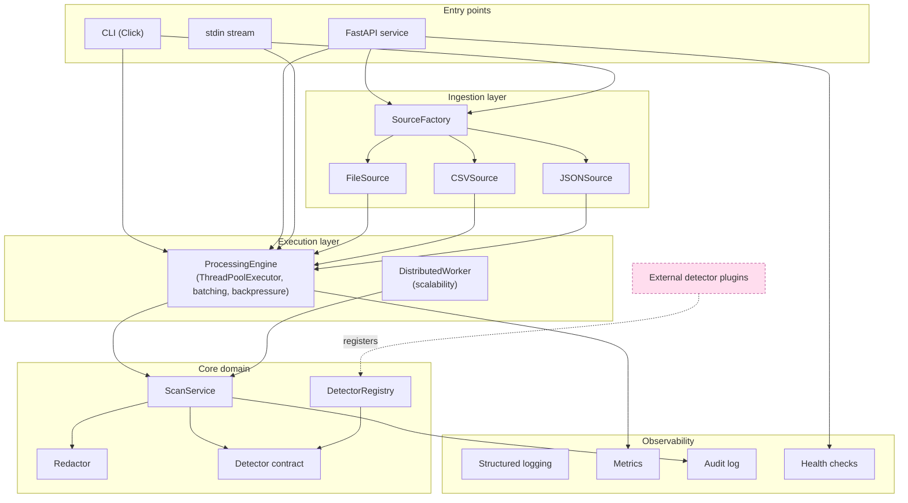
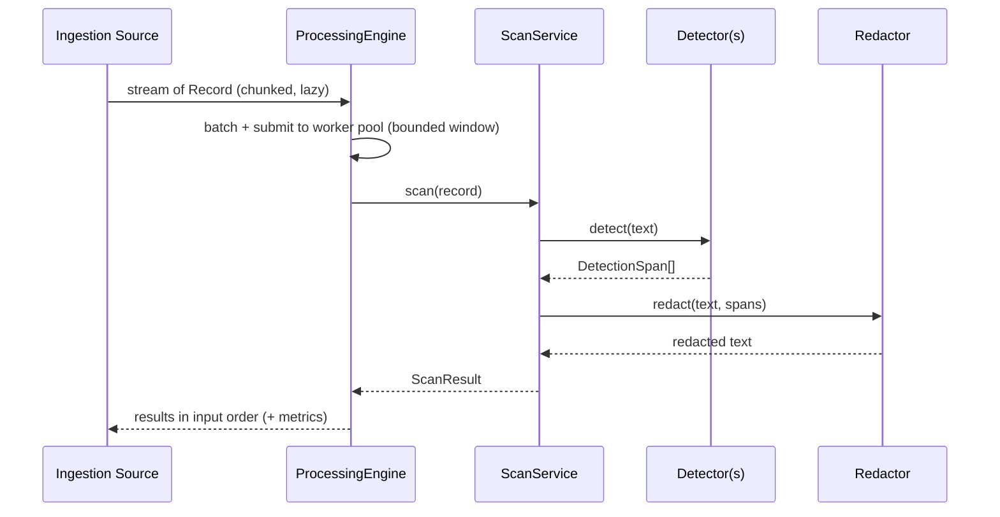

# Architecture

RedactAI is organized as a set of layers with strictly inward-pointing
dependencies. The **core** layer knows nothing about files, HTTP or threads;
the outer layers depend on the core, never the reverse. Detection logic enters
only through the `Detector` contract.

## Layered overview

## Request/data flow

## Design principles

- **Dependency inversion via the detector contract.** The engine depends on
  `DetectorProtocol`, never on a concrete detector. Detection is always a
  plugin (`DetectorRegistry`, entry points).
- **Composition root.** `core.Container` is the only place that wires concrete
  implementations from `Settings`. Everything else receives collaborators by
  argument, keeping units testable.
- **Backpressure by construction.** The engine keeps a bounded sliding window
  of in-flight batches, so a multi-GB file or a fast `tail -f` can never
  outrun memory.
- **Fail-open security posture.** A misbehaving detector is logged and skipped
  rather than dropping traffic (configurable to fail-closed for strict envs).
- **Boundary validation.** Pydantic models validate input at the edges (API,
  config); the hot path uses a lightweight frozen `DetectionSpan` dataclass.

## Milestone tradeoffs

| Area | Choice | Tradeoff |
|------|--------|----------|
| Concurrency | `ThreadPoolExecutor` | Ideal for I/O-bound and C-extension detectors (regex/Presidio release the GIL). CPU-bound pure-Python detectors would prefer processes — see scalability roadmap. |
| Ordering | Engine preserves input order | Slightly less throughput than pure as-completed, but predictable output for file redaction. |
| JSON ingestion | stdlib streaming for JSONL; optional `ijson` for arrays | Zero hard dependency; large JSON arrays need `ijson` for true streaming. |
| Metrics | In-process registry | No external dependency; multi-process aggregation deferred to Prometheus/pushgateway (roadmap). |

## Next steps

1. Integrate the first real detector plugin via an entry point.
2. Add a Prometheus multiprocess collector behind the existing metrics facade.
3. Adopt the scalability layer for multi-host deployments (see
   [`scalability.md`](scalability.md)).
