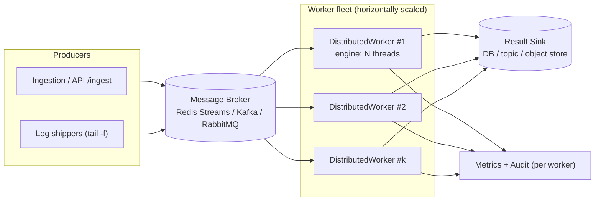
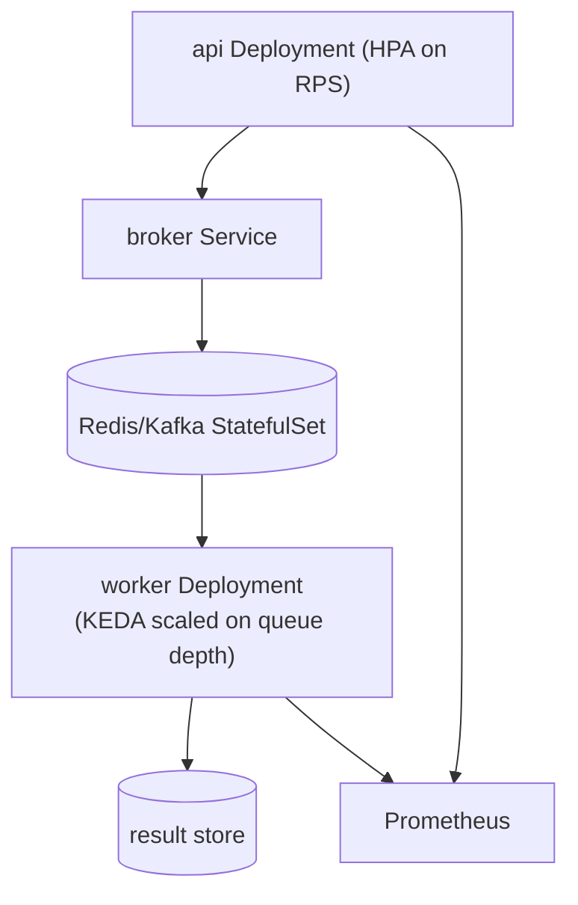

# Milestone 9 — Scalability Layer

This milestone defines how RedactAI scales from a single process to a
distributed fleet **without changing the core**. As with detectors, the
transport is a plugin: the engine depends on the `MessageBroker` and
`ResultSink` Protocols (`redactai.gateway/scalability/broker.py`), and concrete
Redis/Kafka/RabbitMQ adapters implement them.

## Target architecture



Two levels of parallelism: **processes/hosts** (many `DistributedWorker`s) ×
**threads** (each worker's `ProcessingEngine` pool).

## Interface contracts

```python
class MessageBroker(Protocol):
    def publish(self, record: Record) -> None: ...
    def consume(self, *, timeout: float | None = None) -> Iterator[Message]: ...
    def ack(self, message: Message) -> None: ...
    def nack(self, message: Message) -> None: ...
    def close(self) -> None: ...

class ResultSink(Protocol):
    def emit(self, result: ScanResult) -> None: ...
    def close(self) -> None: ...
```

`InMemoryBroker` is the reference implementation (used in tests and local runs).
Adapters only need to satisfy these Protocols.

## Backend mapping

| Backend | Delivery model | When to choose | `ack`/`nack` |
|---------|----------------|----------------|--------------|
| **Redis Streams** | Consumer groups, at-least-once | Simplest ops, moderate throughput, existing Redis | `XACK` / re-add via `XCLAIM` |
| **Kafka** | Partitioned log, replayable | Very high throughput, ordered partitions, audit replay | offset commit / seek-back |
| **RabbitMQ** | Queues + exchanges, routing | Complex routing, priority, per-message TTL/DLX | `basic.ack` / `basic.nack` |

All three support a **dead-letter** path: after `max_retries` nacks, route the
message to a DLQ for inspection rather than looping forever.

## Implementation roadmap

1. **Contracts (done).** `MessageBroker`, `ResultSink`, `Message`,
   `InMemoryBroker`, `DistributedWorker`.
2. **Redis adapter.** `RedisStreamBroker` using consumer groups; config under
   `RG_SCALE__REDIS_URL`. Add `[scale]` extra (already declared).
3. **Result sinks.** `KafkaResultSink`, `DatabaseResultSink`; pluggable like
   detectors.
4. **Kafka adapter.** Partition by record source for ordered per-source
   processing; commit offsets on `ack`.
5. **RabbitMQ adapter.** Topic exchange + DLX; prefetch tuned to engine workers.
6. **Autoscaling signals.** Export `rg_queue_depth` and consumer lag to
   Prometheus; drive HPA/KEDA scaling of the worker Deployment.
7. **Exactly-once-ish semantics.** Idempotent sinks keyed by `record.id` to make
   at-least-once delivery safe.

## Deployment topology (Kubernetes)



## Tradeoffs

- **At-least-once over exactly-once.** Simpler, more available; we make sinks
  idempotent rather than pay the coordination cost of exactly-once.
- **Threads per worker, not async everywhere.** Detector plugins may be sync
  (Presidio/regex); the thread pool accommodates them. Async sinks/brokers can
  still be wrapped at the edges.
- **Broker-agnostic core.** Avoids lock-in; the cost is a thin adapter per
  backend, which is exactly where transport-specific tuning belongs.
